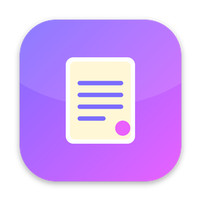
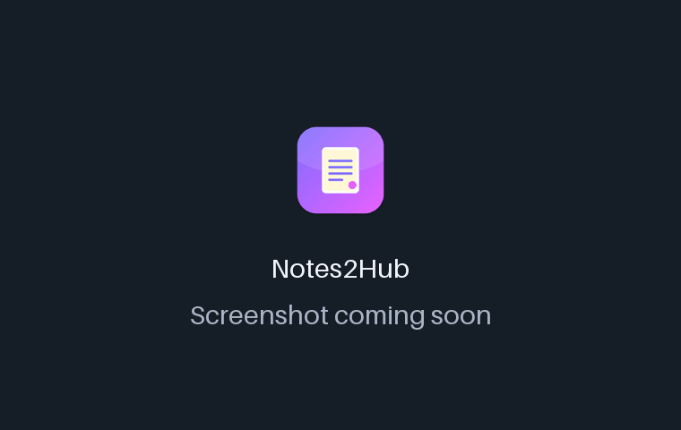
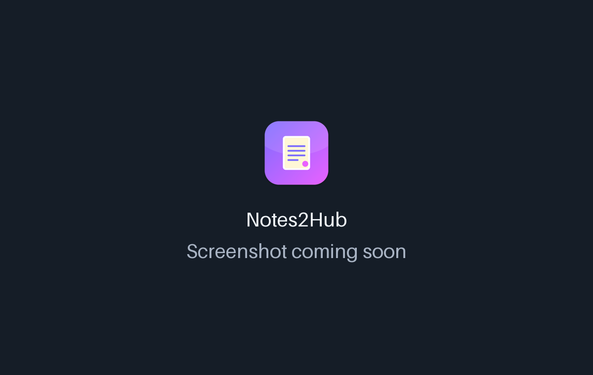

<!-- From jejezz/application-release-templates common/tool/readme @ conventions-v1.
     tool/readme/init_readme.py가 만든 파일입니다 — conventions/readme-guide.md 참고.
     {{TODO: …}}를 모두 채우십시오. 하나라도 남아 있으면 tool/readme/check_readme.py가 실패합니다. -->

<p align="center">
  
</p>

<h1 align="center">Notes2Hub</h1>

<p align="center">
  <b>내 GitHub 저장소</b>로 동기화하는 Markdown 메모 앱 — 서버나 구독 없이 여러 PC에서 이어서 씁니다.
</p>

<p align="center">
  <a href="https://github.com/jejezz/notes2hub-flutter/releases/latest"></a>
  <a href="https://github.com/jejezz/notes2hub-flutter/releases"></a>
  
  
  <a href="LICENSE"></a>
</p>

<p align="center">
  <a href="README.md">English</a> · <b>한국어</b>
</p>

<p align="center">
  
</p>

## 기능

- **내 메모, 내 GitHub 저장소** — 메모 하나가 내가 가진 저장소의 Markdown 파일 하나(`notes/<id>.md`)입니다. 무료이고 서버도 구독도 없으며, 앱이 없어도 메모를 읽을 수 있습니다.
- **저장과 동기화는 별개** — *저장*(⌘S)은 로컬 파일에만 씁니다. *동기화*(⇧⌘S)가 git 작업(커밋, 병합, push)을 합니다. 기본은 수동이고, 저장 30초 뒤 자동으로 바꿀 수 있습니다.
- **여러 PC에서 안전하게** — 시작할 때, 창으로 돌아올 때, 5분마다 가져옵니다. 두 PC에서 같은 메모를 고치면 원격 내용이 본 메모가 되고 내 내용은 "(충돌 …)" 사본으로 남습니다 — 덮어쓰는 일도, 충돌 표시를 직접 지우는 일도 없습니다.
- **목록이 아닌 보드** — 빠른 메모 입력창(쓰고 Enter)과 날짜별 카드, 이미지 표지, 메모별 동기화 상태. 카드를 열면 미리보기가 있는 전체 화면 Markdown 편집기가 열립니다.
- **방해되지 않는 메모 창** — 크기와 위치를 기억하고, 화면 왼쪽·오른쪽 가장자리에 세로로 길게 붙일 수 있습니다. 붙인 상태에서 메모를 열면 편하게 쓰도록 창이 넓어지고, 보드로 돌아오면 다시 좁아집니다.
- **이미지** — 스크린샷을 붙여넣거나, 파일을 끌어다 놓거나, 골라서 넣습니다. 1MiB 이상이면 저장소가 커지지 않게 JPEG로 줄입니다(품질 85 → 50, 그다음 작은 크기). 투명 PNG는 흰 배경이 됩니다.
- **라이트·다크, 한국어·English** — 시스템 설정을 따르거나 툴바에서 고를 수 있습니다

<p align="center">
  
  
</p>

## 설치

[**Releases**](https://github.com/jejezz/notes2hub-flutter/releases/latest)에서 받습니다.

| OS | 파일 |
|---|---|
| macOS 26.0 이상 (Apple Silicon) | `Notes2Hub-<버전>-macos-arm64.dmg` — 열어서 앱을 Applications 폴더로 끌어다 놓으세요 |
| Windows 10/11 (x64) | `Notes2Hub-<버전>-windows-x64-setup.exe` |
| Linux (x64) | `Notes2Hub-<버전>-linux-x64.tar.gz` — 압축을 풀고 `./install.sh` 실행 (`--remove`로 제거) |
| Android 7.0 이상 (64비트) | `Notes2Hub-<버전>-android-arm64.apk` — 폰에서 열어 설치 ("이 출처의 앱 설치" 허용 필요) |

**Windows:** 설치 프로그램에 아직 코드 서명이 없어서 SmartScreen이 "Windows의 PC 보호" 창을 띄웁니다. **추가 정보 → 실행**을 누르세요.

**폰:** Android 앱은 일반 APK입니다(32비트 폰은 지원하지 않습니다). Google Play와 iOS(TestFlight / App Store)는 준비 중입니다 — [docs/MOBILE_RELEASE.md](docs/MOBILE_RELEASE.md). 로그인은 같은 방식입니다: 폰 브라우저에서 승인하고 앱으로 돌아오세요.

## 동작 방식

Notes2Hub는 `git2dart`(libgit2)로 백그라운드 isolate에서 GitHub와 통신하므로 `git`을 따로 설치할 필요가 없고, push 중에도 화면이 멈추지 않습니다. 병합은 파일 단위로 이뤄지는데, 메모마다 UUID 파일 이름을 쓰기 때문에 두 PC가 같은 파일을 건드리는 일은 거의 없습니다. GitHub 토큰은 OS 키체인에만 저장됩니다.

## 개발

```bash
flutter pub get
flutter run -d macos
```

로컬 빌드 값(GitHub Client ID 등)은 git에 올라가지 않는 `dart_defines.local.json`에 둡니다. `dart_defines.local.example.json`을 이 이름으로 복사해 채우고 아래 래퍼로 실행하면, 파일이 있을 때만 `--dart-define-from-file`이 붙습니다.

```bash
tool/flutter_local.sh run -d macos
```

macOS 빌드는 Apple Silicon 전용입니다(동봉된 libgit2가 arm64이고 macOS 26이 필요합니다). Linux에서는 OpenSSL 3(`libssl3`)과, 저장된 토큰을 위한 비밀 저장소(gnome-keyring 등, `libsecret-1-0`)가 있어야 합니다. 브라우저 로그인을 쓰려면 *Device Flow*를 켠 GitHub OAuth App을 만들고 `--dart-define=NOTES2HUB_GITHUB_CLIENT_ID=<client id>`로 넘기세요. 없으면 개인 액세스 토큰(`repo` 권한)으로 로그인합니다. 설계와 결정 기록: [docs/PLAN.md](docs/PLAN.md).

릴리스: `scripts/bump-version.sh patch` → 병합 → `vX.Y.Z` 태그. CI가 모든 플랫폼을 빌드해서 올립니다. 규칙: [application-release-templates/conventions](https://github.com/jejezz/application-release-templates/tree/main/conventions).

## 크레딧

- 글꼴: [서울남산체](https://www.seoul.go.kr/seoul/font.do) (서울특별시)

## 라이선스

[MIT](LICENSE) © 2026 Jongyun Ahn
